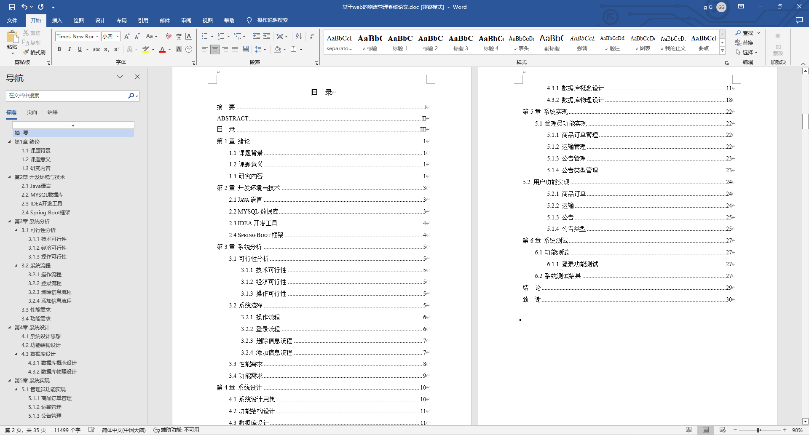

基于Springboot的物流管理系统（程序+论文）
=
### 完整代码获取地址：从戎源码网 ([https://armycodes.com/](https://armycodes.com/))
### 作者微信：19941326836  QQ：952045282 
### 承接计算机毕业设计、Java毕业设计、Python毕业设计、深度学习、机器学习
### 选题+开题报告+任务书+程序定制+安装调试+论文+答辩ppt 一条龙服务
### 所有选题地址https://github.com/nature924/allProject

一、项目介绍
---
基于Spring Boot框架实现的物流管理系统，系统包含三种角色：管理员、用户,员工主要功能如下。
### 【用户功能】

首页：浏览物流管理系统的主要信息。
仓库：查看仓库相关信息，包括存储货物的情况。
公告：阅读系统发布的相关通知和公告。
商品：浏览系统中的商品信息，包括详细描述和价格。
个人中心：管理个人信息，查看订单历史记录等。
客服：与系统提供的客服进行实时交流。

### 【管理员功能】

首页：查看物流管理系统整体概况和关键数据。
个人中心：修改密码、管理个人信息。
管理员管理：审核和管理注册管理员用户的信息。
员工管理：审核和管理注册员工用户的信息。
用户管理：审核和管理注册普通用户的信息。
司机管理：管理系统中的司机信息，添加、删除等。
车辆管理：管理系统中的车辆信息，添加、删除等。
仓库管理：管理系统中的仓库信息，添加、删除等。
出入库管理：监管和管理货物的出入库情况，记录和查询。
商品管理：监管和管理系统中的商品信息，上架、下架等。
货物管理：查看和管理货物的信息，种类和数量等。
公告管理：发布、编辑和删除系统的通知和公告。
反馈信息管理：查看和处理用户的反馈信息。
基础数据管理：管理系统的基础数据，库类型、车辆类型、公告类型、货物类型、商品类型、出入库类型等。
轮播图信息：管理系统首页的轮播图。

### 【员工功能】

首页：查看物流管理系统的主要信息和推荐内容。
个人中心：管理个人信息。
司机管理：查看和管理司机信息，包括行车记录等。
车辆管理：查看和管理车辆信息，包括维护记录等。
仓库管理：查看和管理仓库信息，包括库存情况等。
出入库管理：记录和处理货物的出入库情况，包括入库、出库等。
商品管理：查看和管理商品信息，包括上架、下架等。
货物管理：查看和管理货物的信息，包括种类和数量等。
公告管理：查看和阅读系统发布的通知和公告。
轮播图信息：查看和管理系统首页的轮播图。

二、项目技术
---
- 编程语言：Java
- 数据库：MySQL
- 项目管理工具：Maven
- 前端技术：VUE、HTML、Jquery、Bootstrap
- 后端技术：Spring、SpringMVC、MyBatis

三、运行环境
---
- 操作系统：Windows、macOS都可以
- JDK版本：JDK1.8以上都可以
- 开发工具：IDEA、Ecplise、Myecplise都可以
- 数据库: MySQL5.7以上都可以
- Tomcat：任意版本都可以
- Maven：任意版本都可以

四、运行截图
---
### 论文截图：

### 程序截图：

